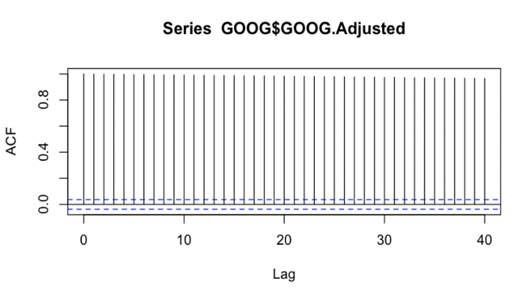

# Stock Price Forecasting and Risk Measurements 

## Problem Statement & Objective: 
- Background: Investors are always looking for ways to maximize their returns while minimizing their risks. Accurate prediction of future stock prices and estimation of risk measures are crucial for making informed investment decisions. ​

- Data: historical stock prices data  in IT, automotive and banking sectors.​

- Aim: Develop effective and robust models and techniques for stock price forecasting and risk measures estimation that can provide accurate and reliable predictions and help investors make informed decisions.

### Stock price forecasting​

- Use time series models like ARIMA model to analyze the historical data of stock prices to identify patterns and trends. ​
- Use machine learning model like Random Forest to train algorithms that can predict future stock prices. ​
- The combination of two models can improve the accuracy of stock price predictions. ​
- Evaluate stock price predictions by MSE, MAE and RMSE.​

    __1. Results__:
    
    
ng">  

 

### Estimate risk measures​

- Calculate monthly log return and fit to AR/GARCH model, then predict one-step-ahead log return.​
- Utilize the return distribution to estimate risk measures like VaR. (estimates the maximum amount of loss that could be incurred on a stock investment within a given confidence interval) ​

    __2. Results__:

### TEXTBOOKS:
[S] Shumway, R.H., and Stoffer D.S., Time Series Analysis and Its Applications. Fourth Edition. Springer.
https://www.stat.pitt.edu/stoffer/tsa4/
[K] Kleiber, C., and Zeileis, A., Applied Econometrics with R. Springe

### OTHER USEFUL SOURCES:
[R] https://www.econometrics-with-r.org/
[E] The elements of statistical learning: https://web.stanford.edu/~hastie/Papers/ESLII.pdf
[D] Kleinbaum, D.G., and Klein M., Survival Analysis: A Self-Learning Text. Third Edition. Springer.
[T] Regress
